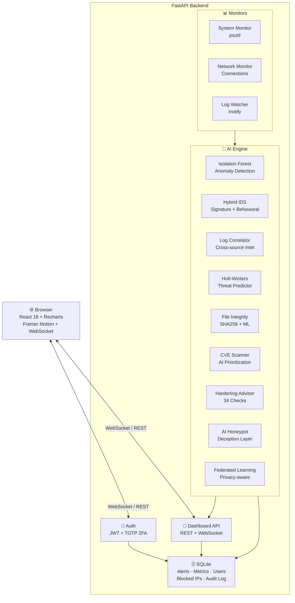

<div align="center">

<h1>🛡️ AI SBC Security</h1>
<h3>S E C U R I T Y &nbsp;·&nbsp; A I &nbsp;E D I T I O N</h3>

**AI-powered security monitoring for Single Board Computers & Linux servers**

[](LICENSE)
[](https://python.org)
[](https://fastapi.tiangolo.com)
[](https://react.dev)
[](https://www.arm.com)
[](https://raspberrypi.org)
[](https://en.wikipedia.org/wiki/X86-64)

[](https://ko-fi.com/P5P46VPK7)

</div>

---

## ⚡ One-Command Lifecycle

The whole lifecycle — install, update, uninstall — is one command each from the terminal.

### Install (new device)
```bash
curl -sSL https://raw.githubusercontent.com/fahimrahmanbooom/ai-sbc-security/main/install.sh | bash
```
Open `http://<your-device-ip>:7443` → create admin account → enable 2FA from Settings → you're protected. AI models begin training automatically.

### Update (after install)
```bash
sudo aisbc -up
```
Smart-update: pulls the latest code, rebuilds the frontend only if it changed, runs `pip install` only if `requirements.txt` changed, then restarts the service. Safe to run anytime — it no-ops if you're already on the latest commit. (You can also click **Update available** in the dashboard for the same flow with progress streamed over WebSocket.)

### Uninstall (complete removal)
```bash
sudo aisbc -uninstall
```
Stops the service, removes the systemd unit, the install directory (`/opt/ai-sbc-security`), the config (`/etc/ai-sbc-security`), and the `aisbc` CLI itself. Asks before removing monitoring data (`/var/lib/ai-sbc-security`) so you can keep your alert history if you plan to reinstall.

If `aisbc` isn't available (broken install), the curl fallback works:
```bash
curl -sSL https://raw.githubusercontent.com/fahimrahmanbooom/ai-sbc-security/main/install.sh | bash -s -- --uninstall
```

---

## What is AI SBC Security?

AI SBC Security is a **free, open-source, AI-first security monitoring platform** purpose-built for single board computers and lightweight Linux servers. Unlike heavyweight SIEM tools that require clusters to run, AI SBC Security boots in seconds on a Raspberry Pi 4 and immediately starts learning and defending your system.

It runs a **9-engine AI stack** — anomaly detection, intrusion detection, log intelligence, predictive threat forecasting, file integrity, vulnerability scanning, hardening audit, honeypot deception, and opt-in federated learning — all offline, no cloud required. Every alert is scored, correlated, and explained in plain language so you know exactly what's happening and what to do about it. See [How the AI Works](#how-the-ai-works) for a deep-dive on each module.

---

## Features

### 🤖 AI Engine — Multi-Layer Detection Stack

**Anomaly Detection** — Isolation Forest ML model that builds a behavioral baseline of your system in real time. It tracks 14 concurrent features including CPU, RAM, network rates, login patterns, connection counts, and temporal rhythms. Once trained (typically ~30 minutes), it flags deviations from normal with a confidence-calibrated score, even for novel zero-day attacks that no signature would catch.

**Intrusion Detection System (IDS)** — A hybrid rule-based + behavioral engine with 11 signature rules covering 10 attack categories mapped to MITRE ATT&CK, plus a stateful port-scan detector. It detects SSH brute force, port scans, SQL injection, XSS, LFI/RFI path traversal, command injection, reverse shells, privilege escalation attempts, crypto-mining processes, and remote-execution one-liners — all with configurable thresholds and a sliding-window deduplication engine so alerts are meaningful, not noisy.

**Log Intelligence** — A real-time log correlation engine that tails `/var/log/auth.log`, `syslog`, `kern.log`, nginx/apache access logs, fail2ban, and any custom paths. It parses, threat-scores, and correlates events across sources within configurable time windows, automatically surfacing insights like "IP X targeted 5 different users in 3 minutes" or "User Y is being attacked from 8 distinct IPs."

**Predictive Threat Model** — A lightweight time-series forecasting engine (Holt-Winters double exponential smoothing + seasonal decomposition) that learns your system's attack patterns over time and forecasts threat levels for the next 24 hours, hour by hour. It identifies your peak-risk windows, detects escalating trends, and generates proactive recommendations — before the attack peaks.

### 🔐 Security

- **TOTP Two-Factor Authentication** — RFC 6238 compliant TOTP (Google Authenticator, Authy, any standard app). QR code setup from the Settings page. Strongly recommended for production.
- **JWT Authentication** — Short-lived access tokens (60 min, configurable via `JWT_EXPIRE_MINUTES`) + long-lived refresh tokens (7 days) with automatic silent refresh.
- **Account Lockout** — Automatic account lockout after 5 failed login attempts (15-minute cooldown).
- **Audit Log** — Authentication events (registrations, login successes/failures, TOTP failures, password changes) are recorded with timestamp, IP, and user agent.
- **Bcrypt Password Hashing** — Industry-standard bcrypt via `passlib` with deprecation-aware scheme handling.

### 📊 Dashboard

- **Real-Time WebSocket Updates** — The dashboard receives live metric pushes every 3 seconds over a persistent WebSocket, with automatic reconnection.
- **Cyberpunk Dark Theme** — Orbitron display font, JetBrains Mono for data, animated glow effects, scanline overlays, matrix rain login screen, threat-level animations.
- **Framer Motion Animations** — All cards, charts, and alerts animate in with spring physics. Threat level bar morphs in real time. Severity badges pulse on critical alerts.
- **Live Charts** — Recharts-powered area charts for CPU/RAM, network in/out (KB/s), and threat levels. All update live from WebSocket data.
- **Alerts Panel** — Full alert log with severity filtering (critical/high/medium/low/info), acknowledge and resolve actions, threat score ring visualization.
- **AI Insights Tab** — 24-hour forecast chart with peak threat prediction, log correlation insights, IDS alert timeline with MITRE ATT&CK tags.
- **Network Panel** — Live connection table, suspicious connection highlighting, bandwidth gauges, listening port inventory.
- **File Integrity Panel** — FIM events list with severity badges and ML-classification labels, baseline summary by directory, force-rescan and rebaseline actions.
- **Vulnerabilities Panel** — CVE findings ranked by AI priority with copy-paste fix commands, severity filtering, manual rescan trigger.
- **Hardening Panel** — A–F score with category breakdown, AI summary, top recommendations, and per-check Auto Fix or Copy-for-manual-fix buttons.
- **Honeypot Panel** — Live probes feed, attack-cluster visualization, top attackers list, payload previews.
- **Blocked IPs Manager** — Add/remove IPs from blocklist, distinguish auto-blocked vs. manually blocked, view block history.
- **Settings** — Security tab (2FA setup/teardown with QR code, password change), Account tab (user info), AI & Privacy tab (federated learning opt-in toggle and privacy budget display).
- **Help & Documentation** — In-app guide for every dashboard section, including a deep-dive on each AI module's architecture.
- **One-Click Update** — Built-in "Update available" indicator that pulls the latest code, rebuilds only what changed, and restarts the service in place — all visible via WebSocket progress stream.

### 🖥️ System Monitoring

- CPU percent, frequency, load averages (1/5/15 min)
- RAM total/used/available, swap
- Disk usage per partition
- **CPU temperature** — reads `/sys/class/thermal/` for Raspberry Pi and ARM boards, falls back to `psutil` sensor APIs for x86
- Network: bytes/packets sent/received, per-second rate calculation, error counters
- Active network connections with suspicious port flagging
- Top processes by CPU (live, with PID, name, CPU%, memory%)
- System uptime and load

### 🔧 Operational

- **One-liner installer** — Auto-detects architecture (ARM64, ARM32, x86_64, RISC-V), installs all dependencies, builds the frontend, generates a secret key, installs a systemd service, and starts monitoring — all in one command.
- **Systemd service** — Runs as a persistent background service, auto-starts on boot, auto-restarts on crash.
- **SQLite database** — No external database required. All data (metrics, alerts, users, audit logs, blocked IPs) stored in a single SQLite file.
- **Docker support** — Full `docker-compose.yml` for containerized deployment.
- **YAML configuration** — Every threshold, interval, and AI sensitivity parameter is tunable in `/etc/ai-sbc-security/config.yaml`.
- **Log rotation aware** — The log watcher detects inode changes and handles rotated log files gracefully.
- **Low resource footprint** — Designed for devices with 512MB–4GB RAM. Single-worker uvicorn, scikit-learn Isolation Forest (not PyTorch), streaming data structures, bounded deques. Typical RAM usage: 80–200MB depending on model training state.

---

## Supported Hardware

| Hardware | Architecture | Status |
|---|---|---|
| Raspberry Pi 4 / 5 | ARM64 | ✅ Fully tested |
| Raspberry Pi 3 | ARM64 | ✅ Supported |
| Raspberry Pi Zero 2W | ARM64 | ✅ Supported (light mode) |
| Raspberry Pi Zero (original) | ARM32 | ⚠️ Supported (limited RAM) |
| Orange Pi / Rock Pi / Odroid | ARM64 | ✅ Supported |
| NVIDIA Jetson Nano | ARM64 | ✅ Supported |
| VisionFive 2 | RISC-V 64 | ✅ Experimental |
| x86_64 Ubuntu / Debian | x86_64 | ✅ Fully tested |
| x86_64 VMs (KVM, VMware, etc.) | x86_64 | ✅ Fully tested |
| Any Linux ARM/x86 SBC | Any | ✅ Should work |

---

## Requirements

- **OS:** Debian, Ubuntu, Raspbian, or compatible (apt-based)
- **Python:** 3.9 or higher
- **Node.js:** 16 or higher (for building the frontend; not needed at runtime)
- **RAM:** 256MB minimum, 512MB+ recommended
- **Disk:** 500MB for installation + data
- **Network:** Internet access only needed during install
- **Privileges:** sudo or root (for packet capture and systemd)

---

## Installation

### Option 1 — One-line (Recommended)

```bash
curl -sSL https://raw.githubusercontent.com/fahimrahmanbooom/ai-sbc-security/main/install.sh | bash
```

This will:
1. Detect your architecture and OS
2. Install Python 3, Node.js, and system dependencies
3. Clone the repository to `/opt/ai-sbc-security`
4. Create a Python virtual environment and install packages
5. Build the React dashboard
6. Generate a random `SECRET_KEY`
7. Install and start a systemd service
8. Print the dashboard URL

### Option 2 — Docker

```bash
# Clone and start with Docker Compose
git clone https://github.com/fahimrahmanbooom/ai-sbc-security
cd ai-sbc-security
docker-compose up -d
```

Dashboard at `http://localhost:7443`.

### Option 3 — Manual

```bash
# 1. Clone
git clone https://github.com/fahimrahmanbooom/ai-sbc-security
cd ai-sbc-security

# 2. Python environment
python3 -m venv venv
source venv/bin/activate
pip install -r requirements.txt

# 3. Build frontend
cd frontend && npm install && npm run build
cp -r dist ../backend/static && cd ..

# 4. Set env vars
export SECRET_KEY=$(python3 -c "import secrets; print(secrets.token_hex(32))")
export DB_PATH=./data/db.sqlite
mkdir -p data/models

# 5. Run
uvicorn backend.main:app --host 0.0.0.0 --port 7443
```

---

## First-Time Setup

1. **Open** `http://<device-ip>:7443`
2. **Create your admin account** — the first registered user is automatically promoted to admin
3. **Enable 2FA from Settings → Security** — strongly recommended. Scan the QR code with any authenticator app (Google Authenticator, Authy, 1Password, etc.) and verify the 6-digit code to activate.
4. **Dashboard is live** — AI models begin warming up immediately

The anomaly detection model reaches full confidence after collecting ~500 samples (~40 minutes at 5-second intervals). Until then, it operates in fallback rule-based mode.

---

## Configuration

Edit `/etc/ai-sbc-security/config.yaml` (installed) or `config/default.yaml` (development):

```yaml
ai:
  anomaly:
    sensitivity: 0.8          # 0.0–1.0 — higher = more alerts
    contamination: 0.05        # Expected outlier fraction
    model_retrain_hours: 24   # Retrain every N hours
  ids:
    alert_threshold: 7         # Minimum score (0–10) to create alert
    block_on_critical: false   # Auto-block IPs on critical IDS hit
  predictor:
    forecast_hours: 24         # Forecast window
    confidence_threshold: 0.75

monitors:
  system:
    cpu_alert_threshold: 90    # Alert when CPU > X%
    temp_alert_celsius: 80     # Alert when temp > X°C
  logs:
    watch_paths:
      - "/var/log/auth.log"
      - "/var/log/nginx/access.log"
      - "/path/to/your/app.log"  # Add custom log paths
```

Restart after changes: `sudo systemctl restart ai-sbc-security`

### Environment Variables

These are read at process startup. The systemd installer sets them in `/etc/ai-sbc-security/env`; for Docker or manual runs, export them before launching uvicorn.

| Variable | Default | Purpose |
|---|---|---|
| `SECRET_KEY` | *(random per run)* | JWT signing key. **Required for production** — if unset, a random key is generated and `CRITICAL` is logged warning that all tokens will rotate on every restart. Generate with `python3 -c "import secrets; print(secrets.token_hex(32))"`. |
| `AISBC_DATA_DIR` | `/var/lib/ai-sbc-security` | Root directory for all persisted state (DB, AI models, FIM baseline, vuln cache, honeypot data, federated learning state). Override for Docker, dev, or non-standard installs. |
| `DB_PATH` | `${AISBC_DATA_DIR}/db.sqlite` | SQLite database path. Overrides `AISBC_DATA_DIR` for the DB only. |
| `MODEL_PATH` | `${AISBC_DATA_DIR}/models` | Where the anomaly model `.pkl` is stored. Falls back to `$TMPDIR/ai-sbc-models` if not writable. |
| `FEDERATED_SERVER_URL` | `https://fed.ai-sbc-security.org` | Federated learning aggregator endpoint. Override to point at a private FL server. |
| `JWT_EXPIRE_MINUTES` | `60` | Access-token lifetime in minutes. Refresh tokens are always 7 days. |
| `CORS_ORIGINS` | *(empty — same-origin)* | Comma-separated list of allowed origins for cross-origin browser access. Set to `*` for fully open (this also disables `allow_credentials`, since browsers reject `*` + credentials). Leave empty if the dashboard is served from the same host as the API (the default deployment). |

---

## API Reference

The backend exposes a full REST API. Interactive docs at `http://<device>:7443/api/docs`.

| Method | Endpoint | Description |
|---|---|---|
| POST | `/api/auth/login` | Login with username/password/TOTP |
| POST | `/api/auth/register` | Create account |
| GET | `/api/auth/me` | Current user info |
| POST | `/api/auth/totp/setup` | Start TOTP setup, get QR code |
| POST | `/api/auth/totp/verify` | Verify and enable TOTP |
| GET | `/api/dashboard/overview` | Full dashboard data snapshot |
| WS | `/api/ws` | WebSocket live stream |
| GET | `/api/alerts` | Alert log (filterable) |
| PATCH | `/api/alerts/{id}/resolve` | Resolve alert |
| GET | `/api/ai/forecast` | 24h threat forecast |
| GET | `/api/ai/insights` | Log insights + IDS alerts |
| GET | `/api/network/connections` | Live connections |
| GET | `/api/blocked-ips` | Blocklist |
| POST | `/api/blocked-ips` | Block an IP |
| GET | `/api/audit-log` | Audit trail (admin only) |

---

## Architecture



---

## How the AI Works

AI SBC Security runs nine independent AI/ML modules, each chosen for a specific class of problem and tuned to fit on a Raspberry Pi 4 (≤200MB RAM, no GPU). Everything runs **offline**. There is no LLM, no GPU inference, and no cloud roundtrip in the hot path.

### 1. Anomaly Detection — Isolation Forest

**Model.** scikit-learn `IsolationForest` (100 trees) wrapped in a `Pipeline` with `StandardScaler`. Picked because it scales to many features without requiring labeled data, isolates outliers in O(n log n), and stays under 50MB RAM with the default settings.

**Features (14).** CPU %, RAM %, disk %, four network rates (bytes & packets, in & out, per second), CPU temperature (normalized), login attempts/min, failed logins/min, open connections, process count, hour-of-day, day-of-week. The two temporal features let the model learn that 200 connections at 14:00 is normal but the same at 03:00 is not.

**Training.** Online. Every 5-second metric snapshot is appended to a 5000-sample rolling buffer. Auto-retrain fires every 500 new samples (~40 minutes at 5 s polling). The trained model is persisted to `${MODEL_PATH}/anomaly_model.pkl` so restarts don't lose ground.

**Inference.** Returns `-1` (anomaly) or `1` (normal) plus a decision-function score normalized to a 0–1 anomaly score. Severity bands: critical ≥ 0.85, high ≥ 0.65, medium ≥ 0.40, low otherwise. The detector also runs a z-score pass over each feature against the buffer mean to identify *which* features are anomalous, so alerts say "unusual activity in CPU and failed_logins" rather than "something's weird."

**Fallback.** Until ~50 samples have been collected, a rule-based detector runs (CPU > 90, RAM > 92, failed logins > 10/min, network > 100 MB/s) so you have coverage from minute one.

**Trade-offs.** Excellent for genuinely novel deviations and zero-day-ish behaviour. Will drift if an attacker very slowly shifts the baseline (tune `contamination` lower if your environment is unusually steady). Requires ~30 minutes of clean baseline data for full confidence.

### 2. Intrusion Detection (IDS) — Hybrid Signature + Behavioral

**Why hybrid.** Signature engines catch known attack patterns instantly (regex match is microseconds); behavioral detectors catch volumetric attacks that no single line gives away.

**Signature engine.** 11 compiled regex rules, each tagged with a threat score, MITRE ATT&CK technique, and a `(threshold, window_seconds)` deduplication tuple. Rules cover SSH brute force, root SSH, invalid-user SSH, sudo escalation, SQLi, XSS, path traversal/LFI, command injection, crypto-mining process names, reverse-shell payloads, and `wget|bash` style remote-execution one-liners.

**Sliding-window dedup.** Every match for a given (rule, source IP) is timestamped in a deque. The rule only fires when ≥ N matches have landed in the last W seconds. This is what stops a single mistyped password from generating an alert while still catching 20 attempts in 60 s.

**Port-scan detector.** Stateful tracker per source IP — counts unique destination ports in a 60 s window; alerts at 15+. Whitelists `127.0.0.1` and `::1` so local processes don't trigger.

**Process analyzer.** Same regex set runs over command lines so a `xmrig --pool=...` process is caught even if it leaves no log line.

**Trade-offs.** Will not catch novel attacks (that's the anomaly engine's job). Tune `alert_threshold` in YAML if your environment has noisy logs.

### 3. Log Intelligence — Keyword Scoring + Cross-Source Correlation

**Per-line scoring.** Each log line is scored against a curated keyword dictionary across four severity tiers: critical (`reverse shell`, `rootkit`, `cryptominer`), high (`failed password`, `injection`, `permission denied`), medium (`port scan`, `fail2ban`, `blocked`), low (`login`, `logout`). Score = max weight of any matched keyword.

**Per-line parsing.** Regex extracts timestamp, IP, user, level (debug/info/warning/error/critical), and process name. Source format auto-detected from filename (`/var/log/auth.log` → AUTH, `nginx/access.log` → NGINX, etc.).

**Correlation engine** runs every 60 s and produces three insight types:
- **Sustained attack** — same IP generates ≥ 3 high-severity events in 5 minutes
- **Credential stuffing** — same IP attempts ≥ 3 distinct users with ≥ 5 failures in 5 minutes
- **Account targeted** — same user fails auth from ≥ 3 different IPs in 5 minutes

Each insight comes with affected IPs/users, event count, timespan, and concrete remediation commands (`iptables -A INPUT -s X -j DROP`, `passwd -l user`, etc.).

**Trade-offs.** No heavy NLP — keyword dictionaries handle 95% of attack chatter at < 1 ms per line. Custom apps can be added via the `monitors.logs.watch_paths` YAML key.

### 4. Threat Predictor — Holt-Winters + Seasonal Decomposition

**Model stack.**
- **Double Exponential Smoothing** (Holt's method, α = 0.25, β = 0.1) on hourly-aggregated threat scores. Captures trend (rising/falling/stable) and projects 24 hours ahead.
- **Seasonal decomposition** with 24-hour period. Each hour's average is divided by the global mean to produce 24 seasonal factors, then applied to base predictions to capture daily attack rhythms ("attacks peak at 03:00 UTC every night").
- **Statistical momentum** — recent 6-hour average vs. prior 6-hour average, mapped to [-1, +1] as a short-term escalation signal.

**Output.** Hour-by-hour predictions with score, confidence (decays linearly from 1.0 at h+1 to 0.4 at h+24), and risk band. Plus an overall risk label, peak hour, trend label, and prose summary with prioritized recommendations.

**Trade-offs.** Holt-Winters runs in microseconds with no external dependencies — perfect for SBCs. It forecasts based on what your past looks like, so it won't anticipate genuinely new attack waves; pair with the anomaly detector for those. Needs ~5 hours of data before forecasts are meaningful.

### 5. File Integrity Monitor — SHA-256 + ML Triage

**Baseline.** SHA-256 of every regular file under `CRITICAL_PATHS` (auth files, SSH config, sudoers, PAM, crontabs, systemd units, kernel modules, /etc, /usr/bin, /usr/sbin, /bin, /sbin) up to depth 3. Skips files > 50 MB and noisy extensions (`.pyc`, `.log`, `.tmp`, `.swp`). Saved to `${AISBC_DATA_DIR}/fim_baseline.json`.

**Diff scan** runs every 5 minutes and emits `modified`, `added`, `deleted`, `permissions` events.

**Severity classifier.** A 10-feature heuristic — is_critical_auth, is_executable, is_suid, odd_hour (< 06:00 or ≥ 22:00), rapid_change (≤ 60 s since last change to same path), size_spike (> 50% larger), permission_loosen (mode bits relaxed), root_owned_change, deleted_critical, new_executable. Weighted sum produces a 0–1 suspicion score → label (`benign`, `suspicious`, `malicious`).

**Anomaly model.** After 200 events have been observed, an Isolation Forest trains on the feature vectors and is blended 60/40 with the heuristic score. This gradually adapts to *your* environment's normal change patterns (e.g. weekly package updates touching `/usr/bin`).

**Auto-rebaseline.** Benign-classified changes silently update the baseline so apt/dnf upgrades don't generate noise. Only suspicious/malicious events fire callbacks.

**Trade-offs.** Bulletproof against tampering once baselined, but the baseline itself must be protected — set strict permissions on `${AISBC_DATA_DIR}` so an attacker can't rewrite it.

### 6. Vulnerability Scanner — CVE Match + AI Prioritization

**Package enumeration.** `dpkg-query` (Debian/Ubuntu/Raspbian), `rpm` (RHEL/Fedora), or `apk` (Alpine) — auto-detected. Returns name, version, architecture, description.

**CVE database.** 20 embedded high-impact CVEs always-available offline (Log4Shell, Dirty Pipe, PwnKit, Looney Tunables, XZ backdoor, OpenSSH agent RCE, etc.). Optional NVD cache file at `${AISBC_DATA_DIR}/vuln_cache/nvd_simplified.json` for broader coverage.

**AI prioritizer.** Raw CVSS is adjusted by deployment-context modifiers:
- **+ 1.5** if `attackVector=NETWORK` *and* the package is currently `LISTEN`ing on a port (mapped via psutil → process → package)
- **+ 0.5** for `attackComplexity=LOW`
- **+ 0.5** for `privilegesRequired=NONE` (unauthenticated)
- **+ 0.3** for SBC-amplified packages (kernel, openssh, openssl, sudo, polkit, glibc, dbus, systemd, bash, dpkg)
- **+ 0.5** for kernel/glibc local-privilege-escalation (physical SBC threat is real)
- **− 0.5** if user interaction required, **− 0.3** for `attackComplexity=HIGH`

The result is a 0–10 priority score, label (`critical/high/medium/low`), plain-English rationale ("CVSS 7.8 adjusted to 9.3: service is actively listening; low attack complexity; no authentication required"), and a copy-paste fix command.

**Trade-offs.** Embedded CVE list is curated, not exhaustive. To extend coverage, drop a JSON file at the cache path with the same schema as the embedded entries.

### 7. Hardening Advisor — Rule-Based Audit

**Why rule-based.** Hardening best practices are stable and well-defined (CIS benchmarks, STIGs). ML adds nothing here; clarity matters more.

**Domains audited (34 checks total).** SSH (8 sshd_config checks), firewall (active + default-deny), kernel sysctl (8 hardening params: `ip_forward`, `accept_source_route`, `accept_redirects`, `randomize_va_space`, `dmesg_restrict`, `tcp_syncookies`, `suid_dumpable`, `log_martians`), SUID binaries (vs. known-safe list), sudo (NOPASSWD entries, unrestricted ALL=(ALL) ALL grants), users (UID 0 duplicates, empty passwords, system accounts with login shells), services (telnet/rsh/rlogin/tftp/finger/talk plus open-port count), file permissions (shadow, passwd, gshadow, sudoers, crontab, sshd_config).

**Scoring.** Each check has a points-impact (3–25). Total deducted vs. total possible → 0–100 score → grade (A+ ≥ 95, A ≥ 90, B ≥ 80, C ≥ 70, D ≥ 55, F < 40). Proportional, so adding more checks doesn't crash old scores.

**AI summary generator.** Sorts failed findings by severity and points-impact, generates a plain-English posture summary ("Security posture: FAIR (72/100). 2 critical failures require immediate attention. Weakest areas: ssh, kernel.") and a prioritized recommendation list with copy-paste fix commands.

**Auto-fix.** Each check ships with an idempotent fix command. The dashboard's `Auto Fix` button runs it directly (the service runs as root, so no sudo prompt). Always review the command before applying.

### 8. Honeypot — Decoy Services + Payload Clustering

**Listeners.** asyncio TCP servers on 10 attacker-magnet ports — 2222 (fake SSH), 8080 (fake HTTP), 23/2323 (fake Telnet), 3389 (fake RDP), 1433 (fake MSSQL), 3306 (fake MySQL), 6379 (fake Redis), 5900 (fake VNC), 21 (fake FTP). Each sends a service-realistic banner and reads up to 2 KB before closing.

**Payload classifier.** Pattern dictionary across four categories:
- **credential_brute_force** — `USER`/`PASS` strings, common credentials, repeated probes from same IP
- **exploit_attempt** — directory traversal, sensitive paths (`/etc/passwd`, `/etc/shadow`, `/proc/self`, `~/.ssh/authorized_keys`), SQLi keywords, NOP sleds, web shells
- **recon** — `HEAD`, `OPTIONS *`, `HELP`, `VERSION` style probes
- **port_scan** — empty payload on connect (banner-grab without follow-up)

Service-specific multipliers: SSH brute-force scoring is 1.5× on the SSH honeypot; SQLi scoring is 1.3× on MySQL/MSSQL.

**Fingerprint clusterer.** Lightweight similarity grouping by (label match + port overlap + recency + same /24 subnet). Up to 20 active clusters; oldest is evicted when full. Lets the dashboard show "27 probes from the same /24 trying credential brute force" instead of 27 separate alerts.

**Auto-feed to IDS.** Probes scoring ≥ 0.7 with `exploit_attempt` or `credential_brute_force` are forwarded to the IDS for blocking.

**Trade-offs.** Skips RFC1918 / loopback / link-local source IPs by default to avoid alerting on internal scanning. Listens on `0.0.0.0` — disable in Settings if you don't want public-facing decoys.

### 9. Federated Learning — Privacy-Preserving Model Improvement

**Opt-in only.** Disabled by default; toggle in Settings.

**What's transmitted.** ONLY the IsolationForest weight tensors — tree thresholds, node sample counts, value arrays. Limited to 20 trees per upload. **Never raw logs, IPs, usernames, hostnames, or any operational data.**

**Differential privacy.** Gaussian mechanism. Tree-threshold weights are clipped to L2 norm ≤ 1.0, then perturbed with Gaussian noise (σ = noise_multiplier × sensitivity = 0.1 × 1.0 = 0.1). Privacy budget per upload is conservative — ε ≈ 0.0005 with δ = 1e-5, so even an adversary with full access to all uploads cannot learn anything specific about your data.

**Aggregation & download.** The central server runs FedAvg over all opt-in clients. On download, your local model blends 30% community / 70% local thresholds — a conservative weighted average that nudges your detector toward community knowledge without overwriting your environment-specific learning.

**Cadence.** Uploads every 24 h, downloads every 12 h. Anonymous random node ID generated locally and never linked to system identifiers.

**Trade-offs.** Helps your detector spot novel attacks seen by other deployments. The DP noise costs slight accuracy but is non-negotiable for meaningful privacy. Marginal benefit if your local data is already rich; meaningful benefit on quiet systems with little training data.

---

## MITRE ATT&CK Coverage

The IDS engine maps detections to MITRE ATT&CK techniques:

| Detection | MITRE ID | Tactic |
|---|---|---|
| SSH Brute Force | T1110 | Credential Access |
| Root SSH Attempts | T1078 | Valid Accounts |
| Invalid User SSH | T1110.001 | Credential Stuffing |
| Sudo Escalation | T1548.003 | Privilege Escalation |
| SQL Injection | T1190 | Initial Access |
| XSS | T1059.007 | Execution |
| Path Traversal/LFI | T1083 | Discovery |
| Command Injection | T1059 | Execution |
| Reverse Shell | T1059.004 | Execution |
| Port Scanning | T1046 | Discovery |
| Crypto Mining | T1496 | Impact |
| Malicious Download | T1059.004 | Execution |

---

## Management Commands

```bash
# Service management
sudo systemctl status ai-sbc-security    # Check status
sudo systemctl restart ai-sbc-security   # Restart
sudo journalctl -u ai-sbc-security -f    # Follow logs
sudo journalctl -u ai-sbc-security -n 100 --no-pager  # Last 100 lines

# Configuration
sudo nano /etc/ai-sbc-security/config.yaml   # Edit config
sudo cat /etc/ai-sbc-security/env            # View env vars (secret key, etc.)

# Data
ls /var/lib/ai-sbc-security/                 # Data directory
ls /var/lib/ai-sbc-security/models/          # AI model files
sqlite3 /var/lib/ai-sbc-security/db.sqlite   # Inspect database

# Uninstall
curl -sSL https://raw.githubusercontent.com/fahimrahmanbooom/ai-sbc-security/main/install.sh | bash -s -- --uninstall
```

---

## Security Considerations

**Network Exposure** — The dashboard binds to `0.0.0.0:7443` by default. If your device is exposed to the internet, consider placing it behind a reverse proxy (nginx) with HTTPS and rate limiting. Example nginx config:

```nginx
server {
    listen 443 ssl;
    ssl_certificate /etc/ssl/certs/cert.pem;
    ssl_certificate_key /etc/ssl/private/key.pem;
    location / {
        proxy_pass http://localhost:7443;
        proxy_http_version 1.1;
        proxy_set_header Upgrade $http_upgrade;
        proxy_set_header Connection "upgrade";
    }
}
```

**2FA is strongly recommended** — Without 2FA, a stolen password is enough to access the dashboard. Enable it during first-time setup.

**Capabilities vs Root** — The installer sets `CAP_NET_RAW` on the Python binary to enable packet capture without running as root. This is scoped to that binary only.

---

## Recent Improvements

- **Stable continuous training** — the anomaly detector now retrains cleanly every 500 samples without lock contention, so detection accuracy keeps improving over hours and days of operation without manual restarts.
- **Federated learning fully wired** — model weight uploads and community-weight downloads now flow end-to-end. Opt-in clients begin contributing within 24 hours of enabling FL in Settings, and detector updates are blended in conservatively (30% community / 70% local).
- **Single `AISBC_DATA_DIR` for all state** — every persisted artefact (DB, models, FIM baseline, vuln cache, honeypot data, FL state) honours one environment variable, making Docker and custom-path deployments straightforward.
- **Configurable CORS** — defaults to same-origin (no CORS headers needed in standard installs); set `CORS_ORIGINS` for cross-origin dev or multi-host deployments.
- **`SECRET_KEY` safety net** — the auth layer now logs a `CRITICAL` warning when `SECRET_KEY` is missing, instead of silently generating a fresh random key on every restart that would invalidate all issued JWTs.
- **Better honeypot coverage** — payload classifier picks up direct sensitive-path requests (`/etc/passwd`, `/proc/self`, `~/.ssh/authorized_keys`) and the fingerprint clusterer's `/24` similarity scoring is fixed so distributed-from-one-subnet attacks merge into a single cluster as designed.
- **More accurate private-IP detection** — the geo-lookup and honeypot's RFC1918 filter now correctly distinguish `172.16.0.0/12` (private) from public IPs in `172.32.0.0+`.
- **Dashboard `alerts_by_severity`** — the overview API now returns unresolved-alert counts broken down by severity, ready for richer summary widgets.
- **Python 3.12+ ready** — replaced deprecated `datetime.utcnow()` everywhere via a single `backend.utils.time.utcnow` helper. Forward-compatible with current and upcoming Python releases.

---

## Contributing

Contributions are welcome! Areas where help is especially appreciated:

- Additional IDS signature rules and threat patterns
- GeoIP integration (MaxMind GeoLite2)
- Email/webhook alert notifications
- Additional log format parsers (journald, Docker, custom apps)
- Fail2ban integration for automatic IP blocking
- UI improvements and new dashboard panels
- Testing on additional SBC hardware

Please open an issue before submitting large PRs to discuss the approach.

---

## License

MIT License — see [LICENSE](LICENSE) for details.

Free to use, modify, and distribute. Attribution appreciated but not required.

---

<div align="center">

**Built for the SBC community with ❤️ — Open Source forever**

[Report a Bug](https://github.com/fahimrahmanbooom/ai-sbc-security/issues) · 
[Request a Feature](https://github.com/fahimrahmanbooom/ai-sbc-security/issues) · 
[Discussions](https://github.com/fahimrahmanbooom/ai-sbc-security/discussions)

</div>
